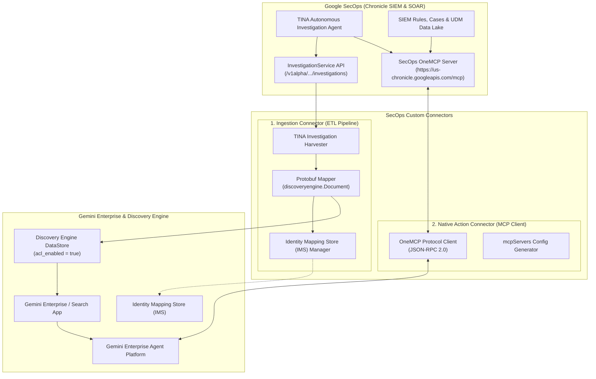
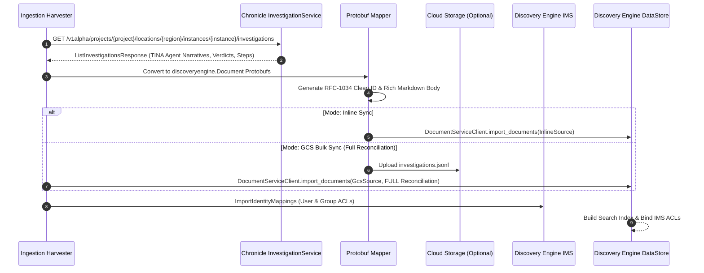
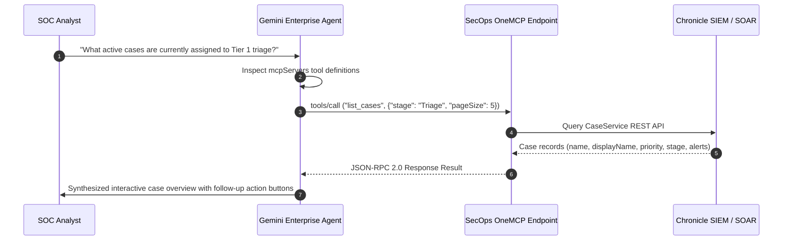

# SecOps Custom Connectors Architecture

This document provides a technical deep-dive into the architecture, component interaction, and security model of the **SecOps Custom Connectors** for **Google Cloud Discovery Engine** and **Gemini Enterprise**.

---

## 🏗️ System Overview

The solution consists of two complementary connectors:

1. **Ingestion Connector (`ingestion_connector/`)**: An asynchronous ETL pipeline that harvests rich investigation outcomes, narratives, verdicts, and telemetry steps from the **Google SecOps (Chronicle) InvestigationService** and indexes them as `discoveryengine.Document` Protobuf messages in an ACL-enabled Discovery Engine DataStore.
2. **Native Action Connector (`native_action_connector/`)**: A query-time Model Context Protocol (MCP) integration that connects Gemini Enterprise conversational agents directly to **SecOps OneMCP** (`https://us-chronicle.googleapis.com/mcp`) for live interactive tool execution (e.g. `list_cases`, `udm_search`, `get_ioc_match`, `fetch_enrichment_actions`).



---

## 📥 1. Ingestion Connector Architecture

The Ingestion Connector runs as a scheduled or on-demand background worker that synchronizes investigation knowledge into Discovery Engine.

### Data Flow & Transformation



### Document Schema & Protobuf Representation

Each investigation is mapped to `google.cloud.discoveryengine.v1.Document`:

```protobuf
message Document {
  string id = 2;               // Normalized Investigation UUID (e.g., 405668c3-d466-4662-b603-e9344d424e5d)
  string json_data = 5;        // Serialized JSON payload containing structured metadata
}
```

The `jsonData` payload contains:
* `title`: Investigation display name / triggered detection rule.
* `verdict`: Final agent determination (`TRUE_POSITIVE`, `FALSE_POSITIVE`, `BENIGN`, `UNCERTAIN`).
* `status`: Lifecycle state (`STATUS_COMPLETED_SUCCESS`, `STATUS_IN_PROGRESS`).
* `summary`: Full multi-paragraph AI synthesis and reasoning narrative from TINA.
* `alert_ids`: List of associated Chronicle SIEM alert ticket IDs.
* `investigation_steps`: Array of sub-actions, telemetry queries, and entity lookup results.
* `start_time` / `end_time`: Investigation execution window.
* `body`: Formatted GitHub Flavored Markdown document optimized for semantic embedding, keyword ranking, and RAG snippet extraction.

---

## ⚡ 2. Native Action Connector Architecture

The Native Action Connector bridges Gemini Enterprise agents with the SecOps OneMCP server over JSON-RPC 2.0.



### Supported Native Tool Categories

| Tool Category | Example Tools | Description |
| :--- | :--- | :--- |
| **Investigation & Triage** | `get_alert_latest_investigation`, `get_investigation_by_id`, `trigger_investigation` | Inspect autonomous agent verdicts, reasoning steps, or trigger new runs. |
| **Case & Alert Management** | `list_cases`, `get_case`, `update_case`, `list_case_alerts`, `list_case_comments` | Retrieve and modify SOC cases, assignees, priorities, and stages. |
| **Telemetry & Threat Hunting** | `udm_search`, `get_ioc_match`, `summarize_entity`, `search_entity` | Run real-time UDM queries and match indicators against threat intelligence. |
| **Detection Engineering** | `list_rules`, `get_rule`, `create_rule`, `validate_rule`, `list_rule_detections` | Inspect and validate YARA-L detection rules. |
| **Automated Response** | `fetch_enrichment_actions`, `execute_actions`, `execute_manual_action` | Run SOAR playbooks and entity enrichment actions. |

---

## 🔒 3. Security & Access Control Model

### Identity Mapping Store (IMS) and ACL Enforcement
Enterprise search requires granular access control so analysts only see investigations and telemetry permitted by their organizational role:

1. **Identity Mapping**: Third-party or SecOps identities (e.g. `secops_investigator_1`, `tier1_analyst`) are mapped to Google Workspace / Cloud Identity emails (`analyst@company.com`) or groups (`incident-response@company.com`) via `discoveryengine.IdentityMappingStoreServiceClient`.
2. **DataStore ACL Enforcement**: The Discovery Engine DataStore is created with `acl_enabled=True` and linked to the Identity Mapping Store.
3. **Query-Time Filtering**: Search requests provide `user_info=discoveryengine.UserInfo(user_id=...)` ensuring that search results and generated RAG answers respect document-level ACLs.

### Authentication & Authorization
* **OAuth 2.0 Scopes**:
  * `https://www.googleapis.com/auth/chronicle` (Access to Chronicle SIEM, SOAR, and Investigation APIs)
  * `https://www.googleapis.com/auth/cloud-platform` (Discovery Engine and Cloud Storage API calls)
* **Application Default Credentials (ADC)**: Automatically resolves credentials and attaches `X-Goog-User-Project` quota headers for enterprise GCP projects.
