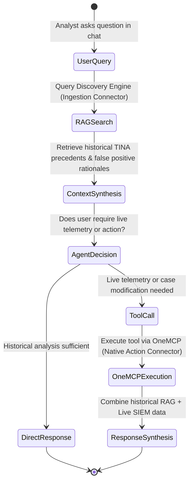

# Gemini Enterprise & Agent Platform Integration

This guide explains how to connect the **SecOps Ingestion DataStore** and the **Native Action OneMCP Server** to **Gemini Enterprise**, the **Gemini Enterprise Agent Platform (GEAP)**, and the **Gemini CLI**.

---

## 1. Connecting Ingested Investigations to Gemini Enterprise

Once the Ingestion Connector has populated the Discovery Engine DataStore (`secops-inv-ds1`), link it to your Gemini Enterprise search application to enable semantic search and RAG synthesis.

### Step 1: Create or Select a Gemini Enterprise Search App

In the Google Cloud Console:
1. Navigate to **Agent Builder** > **Search** (or **Gemini Enterprise**).
2. Click **Create App** and select **Search**.
3. Choose **Generic** industry vertical.
4. Set App Name: `secops-investigations-search`.

### Step 2: Attach the `secops-inv-ds1` Data Store

1. In the app configuration wizard, select **Existing Data Stores**.
2. Select your ACL-enabled DataStore: `secops-inv-ds1`.
3. Verify that the **Identity Mapping Store** (`secops-inv-ims1`) is linked for user/group ACL enforcement.

### Step 3: Configure Query Serving Config

The DataStore automatically provisions the default serving config:
```text
projects/{PROJECT_ID}/locations/global/collections/default_collection/dataStores/secops-inv-ds1/servingConfigs/default_search:search
```

You can test searches directly in the Cloud Console **Preview** tab or via API:
```python
from google.cloud import discoveryengine_v1 as discoveryengine

client = discoveryengine.SearchServiceClient()
request = discoveryengine.SearchRequest(
    serving_config="projects/YOUR_PROJECT_ID/locations/global/collections/default_collection/dataStores/secops-inv-ds1/servingConfigs/default_search:search",
    query="credential dumping LSASS mimikatz",
    page_size=5,
    user_info=discoveryengine.UserInfo(user_id="soc_analyst@company.com"),
)
response = client.search(request=request)
```

---

## 2. Registering Native Action OneMCP with Gemini Enterprise

To give Gemini Enterprise conversational agents the ability to invoke live SecOps tools during chat sessions, register the **SecOps OneMCP** endpoint in your agent tool configuration.

### Generating the Configuration Block

Run the configuration generator from the repository:

```bash
just generate-mcp-config project_id="YOUR_SECOPS_PROJECT_ID"
# Or:
PYTHONPATH=. .venv/bin/python native_action_connector/config_generator.py \
  --project-id "YOUR_SECOPS_PROJECT_ID" \
  --output-file "secops_mcp_config.json"
```

### JSON Configuration Format

```json
{
  "mcpServers": {
    "GoogleSecOps": {
      "httpUrl": "https://us-chronicle.googleapis.com/mcp",
      "authProviderType": "google_credentials",
      "oauth": {
        "scopes": [
          "https://www.googleapis.com/auth/chronicle",
          "https://www.googleapis.com/auth/cloud-platform"
        ]
      },
      "timeout": 30000,
      "headers": {
        "X-Goog-User-Project": "YOUR_SECOPS_PROJECT_ID"
      }
    }
  }
}
```

---

## 3. Configuring Gemini CLI / Extension Directory

If you use **Gemini CLI** or the local extension harness, configure the SecOps OneMCP server in your user settings:

### Configuration Path
Place or merge the JSON block into:
* **Linux/macOS**: `~/.gemini/extensions/secops/gemini-extension.json` or `~/.gemini/config/mcp.json`

### Verification via MCP Tool Discovery

Test that Gemini CLI discovers the 70 native SecOps tools:

```bash
just test-action-list
```

Sample output:
```text
--- Discovered 70 Native SecOps Actions ---
• Name: list_cases
  Description: Request message for ListCases. Filter by Stage, Priority, Status, Assignee.
• Name: get_alert_latest_investigation
  Description: Retrieves the latest TINA autonomous investigation for a specific alert ID.
• Name: udm_search
  Description: Executes real-time UDM telemetry queries across SIEM event records.
• Name: get_ioc_match
  Description: Searches IoC sightings and threat intelligence matches in SecOps telemetry.
• Name: fetch_enrichment_actions
  Description: Retrieves available SOAR integration actions for enriching an alert.
```

---

## 4. End-to-End Hybrid Search & Action Loop

When both connectors are deployed, Gemini Enterprise operates in a powerful **Hybrid Knowledge + Action Loop**:


